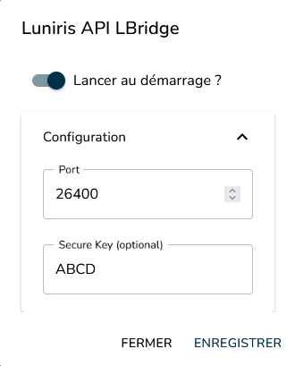

# Luniris API LBridge

A [Luniris](https://luniris.net) feature that exposes the Luniris API over the [LBridge](https://github.com/Asphox/LBridge) protocol, enabling external control of the Luniris digital fursuit eye system by Infition.

## Overview

Luniris provides a gRPC-based API for controlling its digital eye system. While powerful, gRPC can be complex to integrate on resource-constrained devices or non-standard platforms.

**Luniris API LBridge** solves this by bridging the native Luniris gRPC API to [LBridge](https://github.com/Asphox/LBridge) — a lightweight, cross-platform RPC protocol designed for embedded systems and IoT. LBridge is transport-agnostic (TCP, Bluetooth, UART, SPI, ...), has a minimal footprint, and supports optional ChaCha20-Poly1305 encryption, making it ideal for connecting to Luniris from virtually any platform.

This feature is designed to:

- **Simplify feature development** — Build Luniris features without dealing with gRPC directly.
- **Enable external control** — Control the Luniris system from a PC, mobile device, microcontroller, or any embedded platform.

For the full Luniris API reference, see the [Luniris API Documentation](https://luniris.net/docs/category/api).

## Supported Transports

| Transport | Status |
|-----------|--------|
| TCP | Available |
| Bluetooth | Planned |

## Download

[**Download latest release**](https://github.com/Asphox/Luniris_LBridgeAPI/releases/download/v0.1.1/luniris_api_lbridge_server.zip)

## Installation

Luniris API LBridge runs as a **Luniris feature** — it acts as an LBridge server that listens for incoming connections and forwards requests to the Luniris gRPC API.

To install it on your Luniris system, download the zip above and follow the standard feature installation procedure described in the [Luniris documentation](https://luniris.net/docs/features/install-feature).

> **Note:** It is recommended to always use the latest version of Luniris alongside the latest version of Luniris API LBridge to ensure full compatibility.

## Configuration

Once the feature is installed, open its settings. The following window should appear:



From here, you can:

- **Enable auto-start** — Automatically launch the feature when Luniris starts.
- **Port** — Configure the TCP port the LBridge server listens on.
- **Secure Key** (optional) — Set an encryption key to enable ChaCha20-Poly1305 encrypted communication.

> **Important:** Any configuration change requires a restart of the feature to take effect.

## Building from Source

Pre-built binaries are provided in the [releases](https://github.com/Asphox/Luniris_LBridgeAPI/releases) and are the recommended way to install this feature.

Building from source is possible but **not recommended**. The feature must be compiled as a fully static binary to avoid any dependency on the Luniris system's shared libraries, whose versions are not guaranteed. This means building libc, Abseil, gRPC, and all other dependencies statically — a process that is extremely slow and non-trivial to set up.

If you still want to build from source, a build script is provided:

```bash
./build_server.sh
```

## Toybox

A testing application is available to quickly try out the API without writing any code. The Toybox lets you:

- Control eye position and eyelid state
- View real-time IMU data (gyroscope, accelerometer) as graphs
- Monitor temperature
- Trigger registered actions
- Adjust display brightness

Download `luniris_toybox.exe` from the [latest release](https://github.com/Asphox/Luniris_LBridgeAPI/releases).

> **Note:** The Toybox is currently only available for Windows x64.

## Client Library

To connect to the Luniris API LBridge server from your application, use the official client library:

[**Luniris LBridge Client**](https://github.com/Asphox/Luniris_LBridgeClient)

The client library provides a simple C API to interact with the Luniris system over LBridge. It can be integrated into any platform supported by LBridge (PC, mobile, embedded, etc.).
